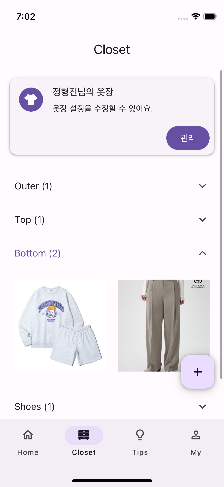
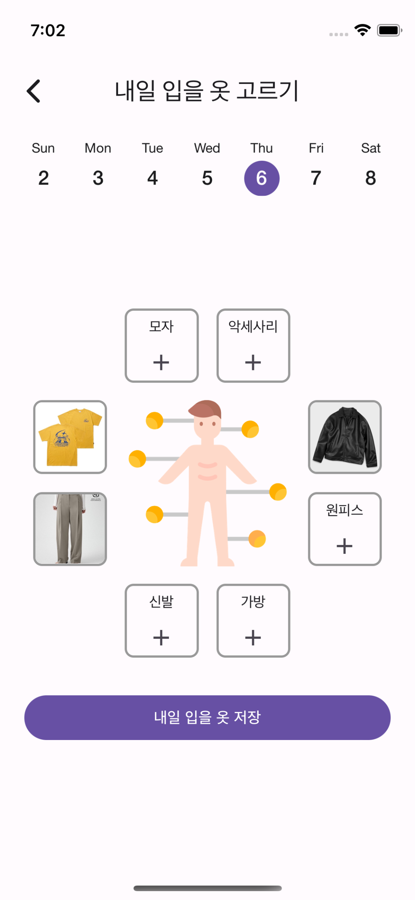
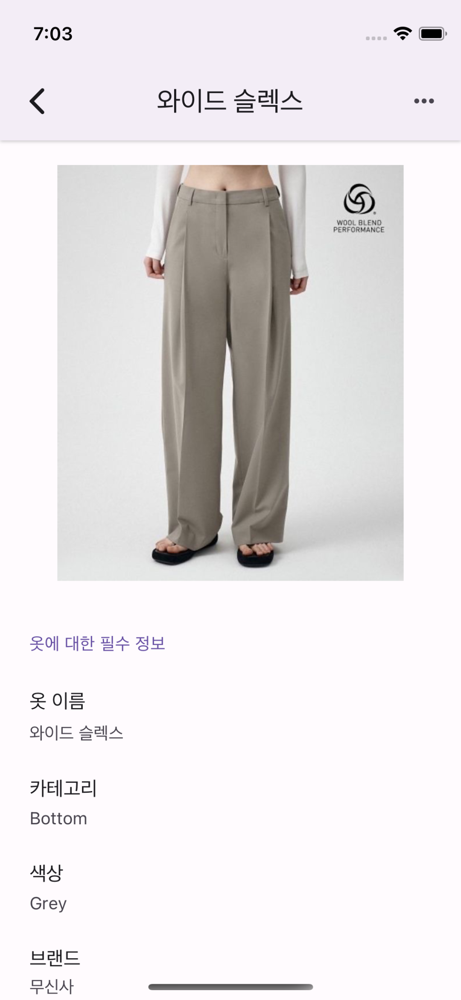
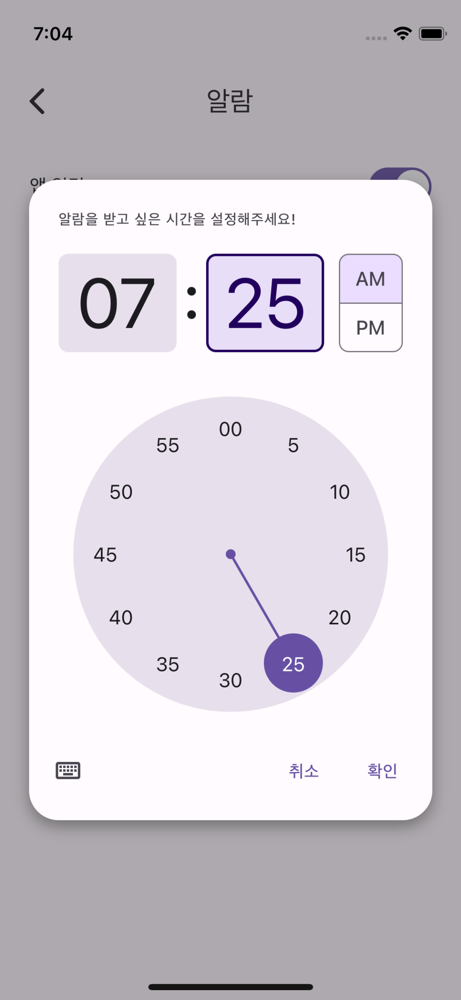

  

<h1 align="center">
  보풀 (in development 👨‍🔧)
</h1>

  
  
  
  

## 👔 Introductions

팀 디토가 만들고 있는 '프로젝트 보풀'은, 옷장에 있는 옷들을 미리미리 기록해두고 앞으로의 스타일링 조합을 결정할 수 있도록 도움을 주는 크로스 플랫폼 어플리케이션이에요.

## 🔧 Stacks

- React Native
- React Native Paper
- React Navigation
- TanStack Query
- Expo
- Styled Components

## 🤼‍♀️ Members

- 정형진 (Fronend)
- 배정훈 (Backend)
- 김연희 (Planner)

## 🚀 Deploy

- Deploy with AppStore
